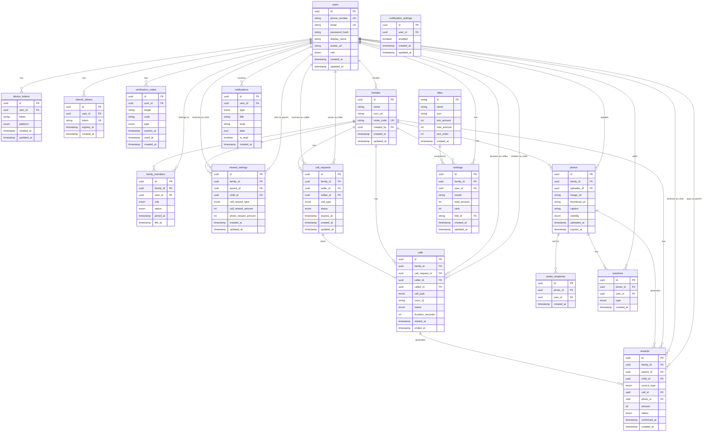
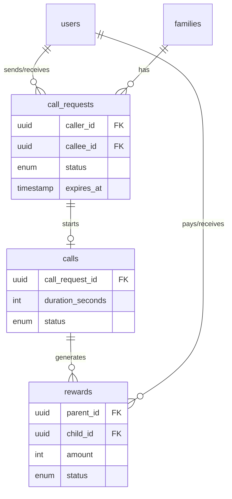
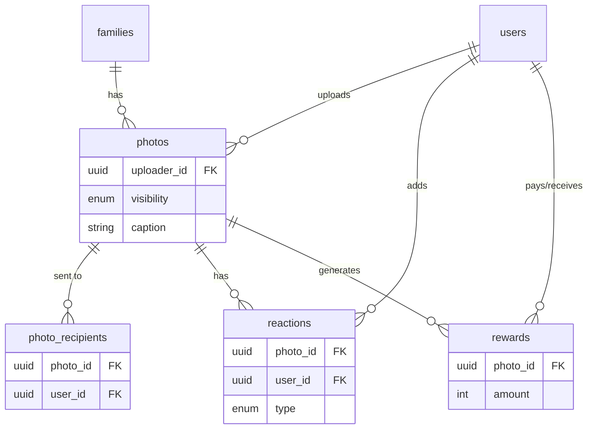
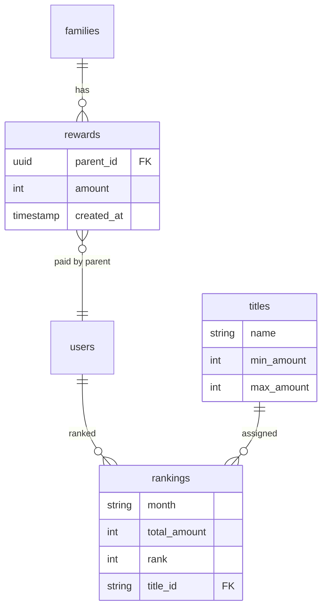

# オヤカツ ER図

## 全体図

```mermaid
erDiagram
    %% ==================== ユーザー関連 ====================
    users {
        uuid id PK
        string phone_number UK
        string email UK
        string password_hash
        string display_name
        string avatar_url
        enum role
        timestamp created_at
        timestamp updated_at
    }

    device_tokens {
        uuid id PK
        uuid user_id FK
        string token
        enum platform
        timestamp created_at
        timestamp updated_at
    }

    refresh_tokens {
        uuid id PK
        uuid user_id FK
        string token UK
        timestamp expires_at
        timestamp created_at
    }

    verification_codes {
        uuid id PK
        uuid user_id FK
        string target
        string code
        enum type
        timestamp expires_at
        timestamp used_at
        timestamp created_at
    }

    %% ==================== ファミリー関連 ====================
    families {
        uuid id PK
        string name
        string icon_url
        string invite_code UK
        uuid created_by FK
        timestamp created_at
        timestamp updated_at
    }

    family_members {
        uuid id PK
        uuid family_id FK
        uuid user_id FK
        enum role
        enum status
        timestamp joined_at
        timestamp left_at
    }

    %% ==================== 報酬設定 ====================
    reward_settings {
        uuid id PK
        uuid family_id FK
        uuid parent_id FK
        uuid child_id FK
        enum call_reward_type
        int call_reward_amount
        int photo_reward_amount
        timestamp created_at
        timestamp updated_at
    }

    %% ==================== 通話関連 ====================
    call_requests {
        uuid id PK
        uuid family_id FK
        uuid caller_id FK
        uuid callee_id FK
        enum call_type
        enum status
        timestamp expires_at
        timestamp created_at
        timestamp updated_at
    }

    calls {
        uuid id PK
        uuid family_id FK
        uuid call_request_id FK
        uuid caller_id FK
        uuid callee_id FK
        enum call_type
        string room_id
        enum status
        int duration_seconds
        timestamp started_at
        timestamp ended_at
    }

    %% ==================== 写真関連 ====================
    photos {
        uuid id PK
        uuid family_id FK
        uuid uploader_id FK
        string image_url
        string thumbnail_url
        string caption
        enum visibility
        timestamp uploaded_at
        timestamp expires_at
    }

    photo_recipients {
        uuid id PK
        uuid photo_id FK
        uuid user_id FK
        timestamp created_at
    }

    reactions {
        uuid id PK
        uuid photo_id FK
        uuid user_id FK
        enum type
        timestamp created_at
    }

    %% ==================== 報酬関連 ====================
    rewards {
        uuid id PK
        uuid family_id FK
        uuid parent_id FK
        uuid child_id FK
        enum source_type
        uuid call_id FK
        uuid photo_id FK
        int amount
        enum status
        timestamp confirmed_at
        timestamp created_at
    }

    %% ==================== ランキング・称号 ====================
    titles {
        string id PK
        string name
        string icon
        int min_amount
        int max_amount
        int sort_order
        timestamp created_at
    }

    rankings {
        uuid id PK
        uuid family_id FK
        uuid user_id FK
        string month
        int total_amount
        int rank
        string title_id FK
        timestamp created_at
        timestamp updated_at
    }

    %% ==================== 通知 ====================
    notifications {
        uuid id PK
        uuid user_id FK
        enum type
        string title
        string body
        json data
        boolean is_read
        timestamp created_at
    }

    notification_settings {
        uuid id PK
        uuid user_id FK
        boolean enabled
        timestamp created_at
        timestamp updated_at
    }

    %% ==================== リレーション ====================
    users ||--o{ device_tokens : "has"
    users ||--o{ refresh_tokens : "has"
    users ||--o{ verification_codes : "has"
    users ||--o{ family_members : "belongs to"
    users ||--o{ families : "creates"
    users ||--o{ reward_settings : "sets as parent"
    users ||--o{ reward_settings : "receives as child"
    users ||--o{ call_requests : "sends as caller"
    users ||--o{ call_requests : "receives as callee"
    users ||--o{ calls : "initiates as caller"
    users ||--o{ calls : "receives as callee"
    users ||--o{ photos : "uploads"
    users ||--o{ reactions : "adds"
    users ||--o{ rewards : "pays as parent"
    users ||--o{ rewards : "receives as child"
    users ||--o{ rankings : "has"
    users ||--o{ notifications : "receives"

    families ||--o{ family_members : "has"
    families ||--o{ reward_settings : "has"
    families ||--o{ call_requests : "has"
    families ||--o{ calls : "has"
    families ||--o{ photos : "has"
    families ||--o{ rewards : "has"
    families ||--o{ rankings : "has"

    call_requests ||--o| calls : "starts"

    photos ||--o{ photo_recipients : "sent to"
    photos ||--o{ reactions : "has"
    photos ||--o{ rewards : "generates"

    calls ||--o{ rewards : "generates"

    titles ||--o{ rankings : "assigned to"
```

## 主要フロー別ER図

### 通話フロー

```mermaid
erDiagram
    users ||--o{ call_requests : "sends/receives"
    families ||--o{ call_requests : "has"
    call_requests ||--o| calls : "starts"
    calls ||--o{ rewards : "generates"
    users ||--o{ rewards : "pays/receives"

    call_requests {
        uuid caller_id FK
        uuid callee_id FK
        enum status
        timestamp expires_at
    }

    calls {
        uuid call_request_id FK
        int duration_seconds
        enum status
    }

    rewards {
        uuid parent_id FK
        uuid child_id FK
        int amount
        enum status
    }
```

### 写真投稿フロー

```mermaid
erDiagram
    users ||--o{ photos : "uploads"
    families ||--o{ photos : "has"
    photos ||--o{ photo_recipients : "sent to"
    photos ||--o{ reactions : "has"
    photos ||--o{ rewards : "generates"
    users ||--o{ reactions : "adds"
    users ||--o{ rewards : "pays/receives"

    photos {
        uuid uploader_id FK
        enum visibility
        string caption
    }

    photo_recipients {
        uuid photo_id FK
        uuid user_id FK
    }

    reactions {
        uuid photo_id FK
        uuid user_id FK
        enum type
    }

    rewards {
        uuid photo_id FK
        int amount
    }
```

### ランキング計算

```mermaid
erDiagram
    families ||--o{ rewards : "has"
    rewards }o--|| users : "paid by parent"
    users ||--o{ rankings : "ranked"
    titles ||--o{ rankings : "assigned"

    rewards {
        uuid parent_id FK
        int amount
        timestamp created_at
    }

    rankings {
        string month
        int total_amount
        int rank
        string title_id FK
    }

    titles {
        string name
        int min_amount
        int max_amount
    }
```
